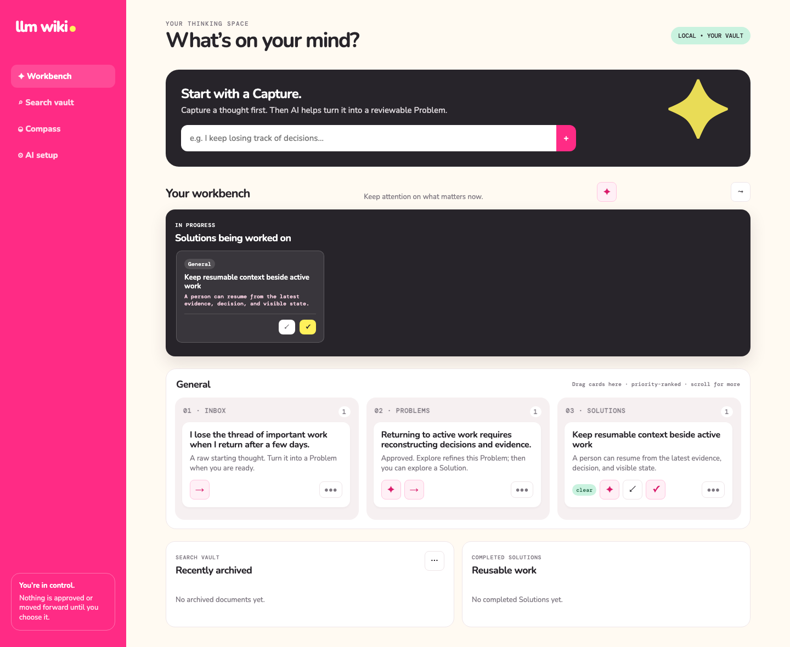

# LLM Wiki

**English** | [한국어](README.ko.md)

> **You talk. The work organizes itself.**

LLM Wiki is an AI-centered, local-first workbench that turns conversation into organized work,
keeps enough context to resume, and publishes only completed outcomes as portable knowledge.



## Product Spirit

LLM Wiki is designed from six non-negotiable principles:

1. **You talk. The work organizes itself.** Conversation and Refinement do the structuring.
2. **Reduce cognitive load.** Capture stays light; current work receives the strongest emphasis.
3. **Resume where you left off.** Work Log screenshots, preserved Refinement context, and Knowledge-backed conflict review make work resumable.
4. **Organize around problems, not tasks.** The durable workflow is **Capture → Problem → Solution**. Execution stays inside the Solution Work Log and validation checklist.
5. **Private process, portable knowledge.** Drafts and working context remain local; only a human-approved completed result becomes Markdown Knowledge.
6. **Understand the work, never score the worker.** Signals explain evidence, risk, and direction—not individual productivity.

See [Product Spirit in the product](docs/product-spirit.md) for the design implications and visible product evidence behind each principle.

## What the product does

| Need | LLM Wiki response |
| --- | --- |
| Get a thought out quickly | Capture accepts a lightweight starting thought without demanding structure. |
| Understand the real problem | AI-guided Refinement preserves context and proposes a reviewable Problem. |
| Choose a way forward | A human-approved Problem can produce a Solution; Knowledge-backed conflict review must be clear before work starts. |
| Resume active work | In Progress Solutions are highlighted; Work Log stores text, screenshots, comments, and validation checks. |
| Complete with evidence | AI reviews recorded evidence, while the human retains the completion decision. |
| Reuse the result | Only completed work becomes an Obsidian-compatible Playbook and searchable Knowledge. |
| Stay responsive during AI work | One hidden Fast Queue throttles interaction; durable work remains visible and recoverable in the background Queue. |

There is no Task stage. LLM Wiki keeps execution attached to the Solution so work never loses the
Problem that explains why it exists.

## Quick start

Requirements: Python 3.12+ and [uv](https://docs.astral.sh/uv/).

```text
uv sync --all-extras
uv run llm-wiki serve --vault /path/to/your-vault
```

Open `http://127.0.0.1:8765`, then configure your OpenAI-compatible endpoint and models in
**AI setup**. AI is a required product capability; local search and manual controls are resilience
fallbacks that preserve private process and human authority during provider failure.

API keys are stored in macOS Keychain or Windows Credential Manager, never in the vault or app
database. The server binds only to `127.0.0.1`.

See [Background AI Queue](docs/features/background-ai-queue.md) for worker roles, recovery,
task-specific results, and notification behavior.

### Korean and English

Use the global language control to switch the interface between Korean and English without
reloading or losing the current view and input. The explicit choice is retained for later sessions;
before a choice is saved, a Korean environment uses Korean and other environments use English.

New, reviewed AI-generated Problems and Solutions keep Korean and English stored versions, while
existing records and Vault files remain unchanged and fall back to their stored original. Live AI
content uses the language active when its request begins. App-managed Knowledge remains
English-canonical Markdown; Korean reading is generated on request without replacing that portable
source. See [Korean and English localization](docs/features/bilingual-localization.md).

### AI model routing

AI Setup has two model fields: a **Default model** for routine work and an **Advanced model** for
quality-sensitive work. Expand **Advanced options** to choose the model tier for each AI task.
Unchecked tasks use the Default model; enabled tasks use the Advanced model, and safely fall back
to the Default model when no Advanced model is configured.

The initial routing uses the Advanced model for discussions and refinement, drafting Problems and
Solutions, conflict review, image summaries, completion review, and completion reports. Workbench
organization, completed-Solution discussion, and Problem enrichment use the Default model by
default. Every choice remains user-configurable in Advanced options.

## Feature guides

- [Product Spirit and product decisions](docs/product-spirit.md)
- [Fast vault search](docs/features/fast-vault-search.md)
- [Problem-centered Workbench](docs/features/conflict-gated-workflow.md)
- [Completion, Knowledge, and archive](docs/features/completion-writeback-archive.md)
- [Compass](docs/features/direction-dashboard.md)
- [Context-preserving Refinement Preview](docs/features/refinement-preview-status.md)
- [Korean and English localization](docs/features/bilingual-localization.md)

## Development

Every specification, plan, implementation, and review must pass the Product Spirit Review Gate in
the [project constitution](.specify/memory/constitution.md).

Backend layers, dependency direction, and the authoritative AI task module map are documented in
the [backend architecture guide](docs/architecture.md).

```text
uv run ruff check .
uv run ruff format --check .
uv run pytest -q
uv run python benchmarks.py
```

Spec Kit artifacts live under [specs/](specs/).
