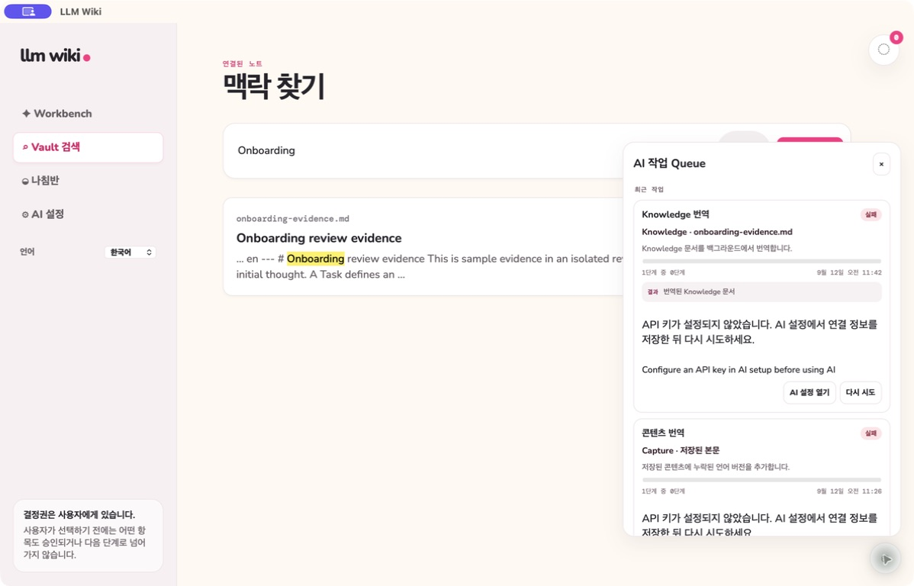
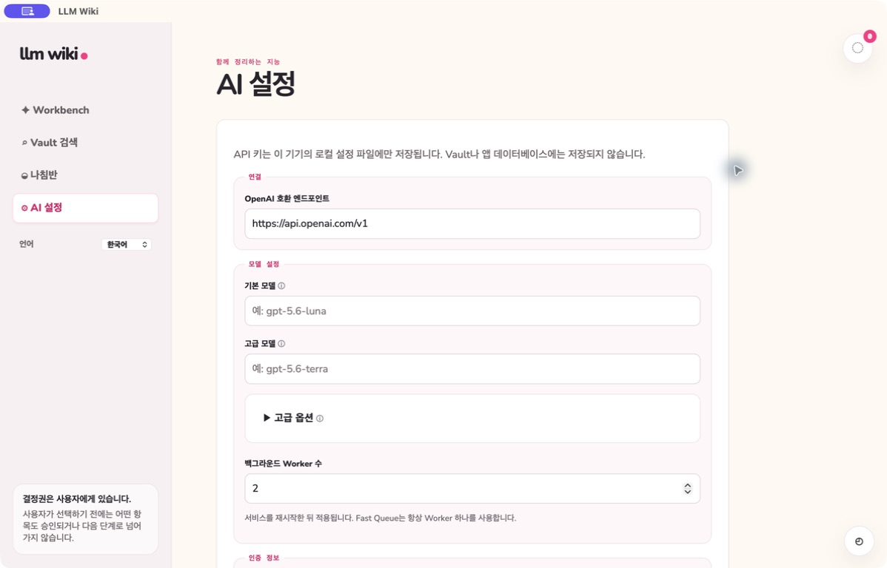

# 백그라운드 AI Queue

[English](background-ai-queue.md) | **한국어**

Queue와 알림 FAB 팝업은 패널 및 해당 FAB 버튼 바깥을 클릭하면 닫힙니다.
팝업 내부 버튼은 정상 동작하며, 다른 FAB를 클릭하면 이전 팝업이 닫힙니다.

완료된 네이티브 작업에는 결과 열기 버튼이 표시됩니다. 이전 버전에서 인라인 미리보기로 저장된
기록도 포함됩니다. 충돌 검토·완료 검토·완료 보고서는 완료 시 결과 버튼이 활성화됩니다.
진행률이 가득 차고 **완료**로 표시되면 대기 중이 아니라 끝난 작업입니다. 결과를 열어 검토하세요.
충돌 검토 재클릭은 저장된 결과를 열며, 새 근거 분석은 **새 검토 실행**으로 요청합니다.

Knowledge 초안 생성도 지속 가능한 Queue에서 실행되며 Task 패널을 닫아도 계속됩니다.
완료 결과를 열면 Task의 검토 탭에서 해당 작업이 생성한 정확한 초안을 볼 수 있습니다.
이후 초안을 수정·게시하거나 새 버전을 만들면 이전 Queue 결과는 읽기 전용으로 열립니다.
현재 초안을 수정 중이면 먼저 저장한 뒤 Queue 결과를 여세요. 완료 확정 전에 취소하면
초안을 저장하지 않으며, 초안 저장과 작업 완료는 함께 확정됩니다. 게시는 별도의 사용자 동작입니다.

LLM Wiki는 상호작용의 반응성을 유지하면서 복구 가능한 작업을 잃지 않도록 AI 실행을 두 개의
프로세스 경로로 분리합니다.

- **Fast Queue**는 FIFO Worker 하나만 사용합니다. Chat과 즉시 반응이 필요한 상호작용을 전역
  요청 제한 경로로 처리하며, 데이터베이스 상태·Queue UI·재시도 기록·알림을 만들지 않습니다.
- **Asynchronous Queue**는 지속 가능한 AI·번역·임베딩 Job을 SQLite에 저장합니다. AI Setup에서
  Worker 수를 조절하며, Worker는 Lease와 Heartbeat로 작업을 점유합니다.

오른쪽 아래 Queue는 각 백그라운드 작업의 대상과 목적을 설명하고, 이해하기 쉬운 상태·단계별
진행률·시스템 타임존 기준 시간·안전한 오류·취소·재시도를 표시합니다. 결과는 작업에 맞는 화면이나 간결한 요약으로
열리며 내부 Job JSON을 사용자 결과로 보여주지 않습니다. 결과가 있는 작업은 실행 중에도 목적지를
표시하고, 완료되면 눈에 띄는 **결과 페이지 열기** 버튼을 활성화합니다. 별도 결과 동선이 필요 없는
작업에는 결과 버튼을 표시하지 않습니다. 레거시 Draft와 Refine 결과는 시작한 창에만 연결되고 창을 닫으면
취소됩니다.
Image Summary는 스크롤 위치를 유지한 채 정확한 Work Log 항목에 붙습니다. Completion Review는
사용자 결정이 필요하므로 잠시 표시되는 Toast와 읽지 않은 항목을 보존하는 종 알림을 함께 만듭니다.

Task Work Log에 이미지 첨부를 저장하면 **Image Summary** 작업이 AI 작업 큐에 자동 제출됩니다.
기존 이미지에서는 **이미지 요약 · 한글 + 영문** 버튼을 사용할 수 있습니다. 한 요청에서 두 언어를
함께 생성하고 저장하며, 현재 화면 언어에 맞는 요약을 표시합니다. 언어를 바꿔도 AI를 다시 호출하지
않습니다. 처리 중에도 이미지는 표시됩니다. 실패하거나 취소된 작업은 해당 기록에서 다시 제출하거나
큐에서 재시도할 수 있습니다. 완료된 큐 결과를 열면 해당 Task로 이동합니다.

작업이 실행 중이고 원본 이미지가 그대로일 때만 요약을 저장합니다. 두 언어의 요약과 큐 완료 상태를
함께 저장하므로 취소된 작업이나 삭제·변경된 대상에 늦은 결과를 반영하지 않습니다. 같은 기록 저장
요청을 반복해도 자동 작업을 중복 제출하지 않습니다. 보존한 Solution·Explore 화면의 기존 이미지
요약 동작도 유지합니다.

Knowledge 번역은 문단 Checkpoint에서 재개하고 번역본을 Vault에 게시한 뒤 SQLite 작업 행을
삭제합니다. Capture와 Work Log 본문을 저장하면 기존 콘텐츠 번역 모듈의 파생 번역 작업을 큐에
제출합니다. 먼저 작성된 자연어 문장의 번역 필요성을 검토한 뒤, 화면 설정과 무관하게 원문에서
주로 사용하는 언어를 판별합니다. 한국어는 영어로, 영어는 한국어로 번역합니다. 코드·명령어·실행 로그·
레퍼런스만 있는 기록은 번역하지 않으며, 혼합 기록은 코드와 레퍼런스를 보존하고 설명만 번역합니다.
원문은 덮어쓰지 않습니다. Task Work Log 번역본은 별도로 저장하며 준비되면 화면 언어에 맞춰
표시합니다. 열려 있는 Task 상세는 번역 대기 중 자동 갱신됩니다. AI 설정 누락이나 제공자 오류가
발생해도 원문을 읽을 수 있으며 Queue에서 실패한 작업을 재시도할 수 있습니다. Queue 카드는 내부 ID 대신 Capture 본문, Work Log 항목, 댓글, 체크리스트 항목을
구분하여 번역 대상을 설명합니다. 임베딩 갱신도 지속 가능한 작업이며 실행 중에도 어휘 검색을 사용할
수 있습니다.

Worker는 제한 재시도, 지수 Backoff, Source Hash, 유효 Lease Token, 취소, 중복 방지 알림을
사용합니다. 동시 Worker는 격리된 애플리케이션/SQLite 연결을 사용하며 SQLite Writer 경합은 최종
실패로 게시하지 않고 재시도합니다. 선택 사항인 Semantic Runtime이 없으면 임베딩 작업은 Semantic
Coverage 0과 어휘 검색 Fallback 결과로 완료됩니다. AI 결과는 제안 또는 파생 표현이며 Workflow
상태, 승인, 완료, Knowledge 결정 권한은
사용자에게 있습니다.

[기능 명세](../../specs/009-background-ai-queue/spec.md)와
[Worker 계약](../../specs/009-background-ai-queue/contracts/worker-contract.md)을 참고하세요. 모든 지속
작업의 단일 Handler 모듈과 자동으로 검증하는 의존성 규칙은
[백엔드 아키텍처 안내](../architecture.ko.md)에 정리되어 있습니다.

## 다듬기 프리뷰

Capture와 Task 다듬기는 전체 제안을 생성하기 전에 채팅 답변을 먼저 반환합니다. 별도의
**다듬기 프리뷰** 큐 작업이 검토할 프리뷰를 저장하며 자동 적용하지 않습니다. 프리뷰 실행
중에도 채팅을 계속할 수 있습니다. 프리뷰를 독립적으로 취소·재시도할 수 있으며 새 대화가
시작되면 이전 결과는 오래된 상태가 됩니다. 앱 재시작 후에도 중단된 프리뷰를 큐에서 재시도할
수 있습니다.
