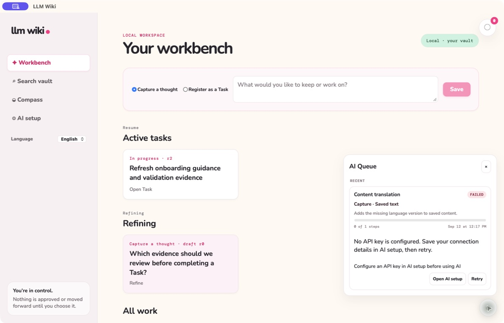
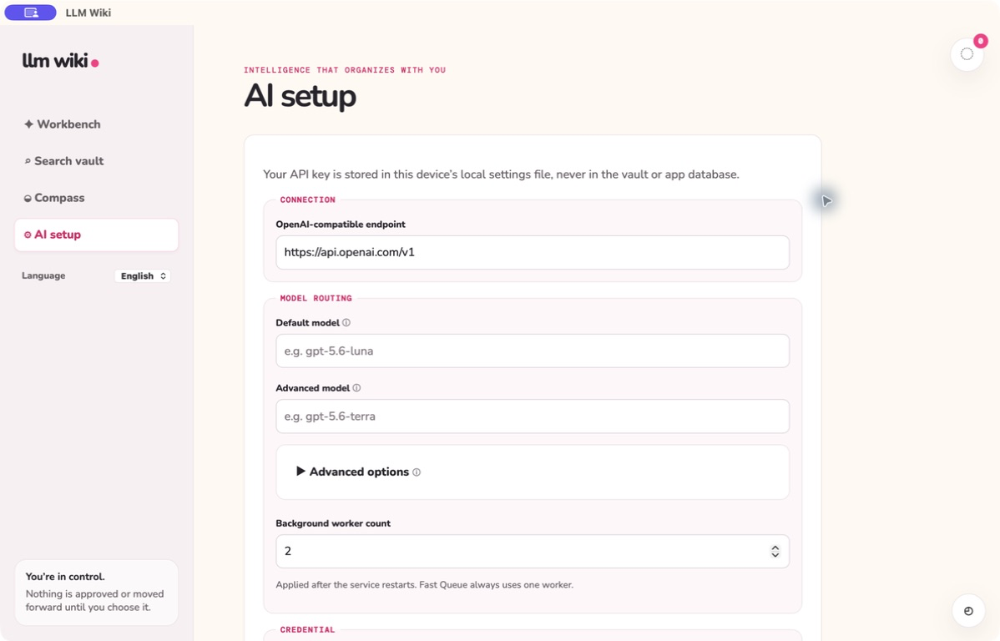

# Background AI Queue

**English** | [한국어](background-ai-queue.ko.md)

Queue and notification FAB popups close when you click outside their panel and trigger.
Clicks inside remain usable; clicking the other FAB dismisses the previous popup.

Completed native jobs expose their result destinations, including older records stored as
inline previews. Conflict reviews, completion reviews, and completion reports have an enabled
result button when complete. A full progress bar with **Completed** is finished work, not a
pending phase; open the result to review it. Repeated Conflict Review clicks reopen saved
results; use **Run fresh review** to request new evidence analysis.

Knowledge draft generation also runs in the durable Queue and continues after its Task panel closes.
Open the completed result to see the exact generated draft in the Task's Review tab. Later edits,
publication, or a newer draft make that saved Queue result read-only. Save any current draft edits
before opening a Queue result. Cancellation before finalization saves no draft; draft storage and
job completion commit together. Publishing remains a separate user action.

LLM Wiki separates AI execution into two process-level paths so interaction stays responsive
without losing recoverable work.

- The **Fast Queue** has exactly one FIFO worker. Chat and other immediate interactions use it as
  a global request throttle. It has no database state, Queue UI entry, retry history, or
  notification.
- The **Asynchronous Queue** stores durable AI, translation, and embedding Jobs in SQLite. Its
  worker count is configurable in AI Setup and workers claim jobs with leases and heartbeats.

The bottom-right Queue names the target item and explains what each durable task is doing. Its cards
show readable status, step progress, system-timezone time, safe failures, cancellation, retry, and only the result
actions that make sense for that task. A task with a result names its destination while running,
then enables a prominent **Open result page** action when complete. Results open the owning workflow
surface or a concise summary; raw job JSON is not used as the user-facing result. Legacy Draft and Refine
results stay bound to their originating dialog and are cancelled when that surface closes. Image
Summary attaches to the exact
Work Log entry without changing scroll position. Completion Review also creates a temporary toast
and a persisted unread bell alert because it requires a user decision.

Saving an image attachment in a Task Work Log automatically submits an **Image Summary** job.
Existing images offer **Summarize image · Korean + English**. Each request generates and stores both
languages together; the current interface language selects the displayed summary without another
AI request. The image remains visible while the job runs. Failed or cancelled work can be submitted
again from the entry or retried from Queue. Opening the completed Queue result opens the owning Task.

Summary results are saved only while the job is active and the source image still matches. Both
language versions and Queue completion commit together; cancelled, deleted, or changed targets do
not receive late summaries. The same saved-entry request does not enqueue a second automatic job.
The retained Solution and Explore surfaces continue to support their legacy image-summary flow.

Knowledge translation resumes from paragraph checkpoints and publishes the completed translation
to the Vault before deleting its SQLite working checkpoints. Capture and Work Log text enqueue
derived translations immediately. The existing Content translation worker first reviews whether
there is authored natural-language prose, then detects its predominant language independently of
the interface setting: Korean prose gets an English version and English prose gets a Korean version.
Code, commands, raw logs, and reference-only material are skipped; mixed entries translate only
prose while preserving code and references. Authored source text is never overwritten. Task Work Log
translations are stored separately and displayed in the selected interface language when ready;
open Task details refresh while translation is pending. Missing AI configuration or provider failures
leave the original readable and the failed job available for retry in the Queue. Queue cards distinguish
Capture text, Work Log entries, comments, and checklist items so each translation target remains
understandable without exposing its internal ID. Embedding refresh is durable and lexical search
remains available while it runs.

Workers use bounded retry, exponential backoff, source hashes, live lease tokens, cancellation,
and idempotent notifications. Concurrent workers use isolated application/SQLite connections;
SQLite writer contention is retried rather than published as a terminal failure. When the optional
semantic runtime is absent, embedding work completes with lexical fallback and zero semantic
coverage. AI output remains a proposal or derived representation: workflow
state, approval, completion, and Knowledge decisions remain under user control.

See [feature specification](../../specs/009-background-ai-queue/spec.md) and
[worker contract](../../specs/009-background-ai-queue/contracts/worker-contract.md). The
[backend architecture guide](../architecture.md) maps every durable task to its authoritative
handler module and documents the enforced dependency rules.

## Refinement previews

Capture and Task refinement return the chat answer before generating the full proposal. The separate
**Refinement preview** queue job saves a reviewable preview without applying it. Chat remains available
while the preview runs. Cancel or retry a preview independently; a newer chat turn makes older preview
results stale. Interrupted previews remain visible for retry after restarting the application.
