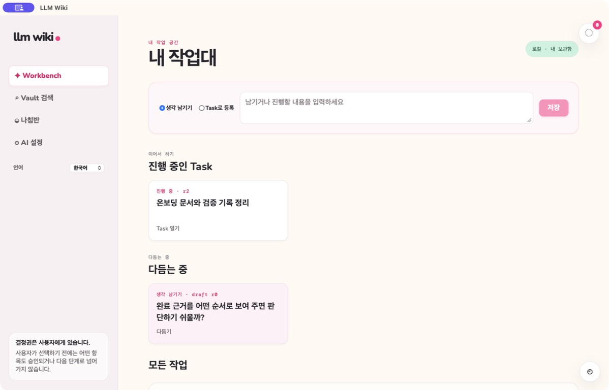

# 한국어·영어 전환

[English](bilingual-localization.md) | **한국어**

> **Resume where you left off.** 언어를 바꿔도 현재 화면, 입력 내용, workflow 계보를 유지해
> 사용자가 처음부터 다시 시작하지 않게 합니다.

LLM Wiki는 앱 전반에서 한국어와 영어를 지원합니다. 모든 주요 화면에서 언어를 바꿀 수 있으며,
전환하면 현재 화면과 저장하지 않은 입력을 유지한 채 인터페이스 문구가 즉시 바뀝니다. 선택한
언어는 다음 실행에도 유지됩니다. 사용자가 직접 선택하기 전에는 한국어 환경에서 한국어를,
그 밖의 환경과 지원하지 않는 환경에서는 영어를 사용합니다.
사용자가 직접 선택한 언어는 로컬 애플리케이션 설정에 저장하며 다음 실행에도 복원합니다.

## 콘텐츠 종류별 동작

| 콘텐츠 | 한국어·영어 처리 방식 |
| --- | --- |
| 메뉴, 제어, 안내, 상태 문구 | 패키지에 포함된 언어 리소스로 즉시 전환합니다. 한국어 문구가 없으면 영어로 표시합니다. |
| 정제된 Task 프리뷰와 적용된 Task | 새 프리뷰는 한국어·영어 내용을 함께 생성합니다. 프리뷰, Workbench 카드, Task 상세는 추가 AI 요청이나 원문 변경 없이 저장된 언어 버전을 표시합니다. |
| Problem 기록 | 작성하거나 생성한 저장 콘텐츠를 유지합니다. 언어 전환은 기록을 다시 쓰거나 새 AI 요청을 만들지 않습니다. |
| AI 이미지 요약 | 새 이미지 작업은 한글·영문을 함께 저장합니다. AI를 다시 호출하지 않고 화면 언어에 맞는 요약을 표시하며, 기존 단일 언어 요약은 대체 표시로 유지합니다. |
| 기존 저장 기록·Vault 파일 | 변경하지 않습니다. 선택한 언어 버전이 없으면 동적으로 번역하지 않고 저장된 원문을 표시합니다. |
| 실시간 AI 대화·검토 | 요청 시작 시점에 활성화된 언어 하나로만 생성합니다. 전환 후에도 이미 나온 응답을 다시 생성하지 않습니다. |
| 조건을 충족한 관리 Knowledge | `llm_wiki_managed: true`, `canonical_locale: en` 표시가 모두 있는 영문 Markdown만 한국어 열람 대상입니다. 정확히 같은 영문 원본일 때만 재사용할 수 있습니다. |

원문 Capture, 수동 입력, Work Log 본문·댓글·체크리스트, 파일 이름, 코드, 식별자, 인용, 원문 발췌는
작성된 언어를 유지합니다. 인터페이스 언어 전환은 기록의 ID나 계보를 바꾸지 않습니다.
사용자는 항목의 정체성과 계보를 바꾸지 않고 누락된 저장 언어 버전을 직접 추가하거나 수정할 수 있습니다.

새 Task Work Log의 자연어 본문은 기존 콘텐츠 번역 모듈로 백그라운드 번역합니다. 번역 전에 필요성을
검토하고, 화면 설정과 무관하게 문장의 원문 언어를 판별해 한국어는 영어로, 영어는 한국어로
번역합니다. 코드·레퍼런스만 있는 기록은 건너뛰며, 설명에 포함된 코드와 레퍼런스도 보존합니다.
원문을 유지한 채 번역본을 별도 저장하고 화면 언어에 맞춰 표시합니다. 언어를 전환해도 새 번역
요청을 보내지 않습니다. 번역 대기·실패 시 원문을 표시하며 실패한 작업은 Queue에서 재시도할 수
있습니다. 기존 기록을 자동으로 소급 번역하지는 않습니다.

Task 번역은 제목, 설명, 결과, 범위, 제외 범위, 검증 기준을 포함하며, 일부 필드만 정제할 때도
변경하지 않은 필드를 함께 번역합니다. 적용한 내용이 생성된 프리뷰와 일치할 때만 번역본을 저장하고,
정확히 해당 Task 내용에 연결합니다. 수동 편집은 원문을 사용하며 언어를 바꿔도 미저장 입력을
유지합니다. 프리뷰를 직접 수정하거나 이후 Task 내용을 변경하면 다시 정제하기 전까지 원문을
표시합니다. 번역본 누락이나 불완전한 응답도 원문으로 대체합니다. 기존 Task와 프리뷰는 소급
번역하지 않으므로 두 언어가 필요하면 새 프리뷰를 생성하고 적용해야 합니다.

## Knowledge와 실패 안전성

한국어 Knowledge는 열람을 위한 보조본이며 영문 canonical Markdown을 대체하지 않습니다. 조건을
충족한 영문 원본이 바뀌면 이전 번역을 더 이상 재사용하지 않습니다. 기존 또는 canonical 표시가 없는
Vault 파일과, 두 managed-English 표시가 없는 Task 발행 Markdown은 앱 언어와 관계없이 원문으로
표시합니다.

완성된 한국어 열람본은 `Translations/ko/<canonical-path>`에 atomic하게 저장합니다. frontmatter에는
canonical 문서 링크와 정확한 원본 경로·hash, locale, model, 생성 시각을 기록합니다. LLM Wiki는 이
디렉터리 전체를 canonical 검색과 인덱싱에서 제외합니다. 앱이 canonical을 변경하면 파생 파일을 즉시
삭제하고, 외부에서 canonical이 변경되거나 삭제되면 watcher 정리 과정에서 제거합니다. 기존 SQLite
캐시가 정확한 hash와 일치하면 최초 재사용 시 이 파일 형식으로 승격합니다.

Knowledge를 클릭하면 정확한 원본 hash에 맞는 한국어 캐시가 있을 때는 그 캐시를, 없을 때는 AI를
기다리지 않고 영문 canonical Markdown을 먼저 표시합니다. 캐시 미스에서는 완료 문단 수와 전체
문단 수를 문서 상단에 고정된 고대비 상태 배지로 알립니다. 완성된 한국어 문단은 영문이 읽는
방향대로 사라지고 그 뒤에서 한국어가 나타나는 약 900ms의 좌→우 파도로 문단 전체를 교체합니다.
토큰 단위 교체나 타이핑 애니메이션은 사용하지 않으며, 모션 감소 설정에서는 문단 전체를 즉시
교체합니다. 다른 문서를 열거나 reader를 닫으면 해당 reader의 진행 상태 연결만 해제하고, durable
번역 작업은 취소하지 않습니다. 작업은 Queue에서 계속 진행되며 문서를 다시 열면 완료된 번역을
재사용합니다. 사용자가 Queue에서 명시적으로 취소하는 기능은 그대로 유지합니다. 실패 시 영문
문단은 계속 읽을 수 있고 명시적인 재시도 버튼을 제공합니다.

이중 언어 생성이나 Knowledge 한국어 번역이 실패해도 성공한 원문과 canonical Markdown은
유지됩니다. LLM Wiki는 누락된 버전을 알리거나 canonical 콘텐츠로 fallback하며, 재시도와 수동
보강 결정은 사용자가 내립니다.

기존 단일 언어 이미지 요약은 마이그레이션하지 않고 저장된 언어로 계속 표시합니다. 새 한·영 요약의
생성 결과가 불완전하거나 실패하면 이전 요약을 덮어쓰지 않습니다.

관련 Spec Kit: [007 — 한국어·영어 전환](../../specs/007-bilingual-localization/spec.md)
