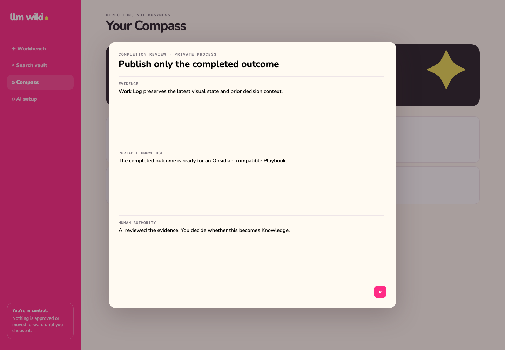
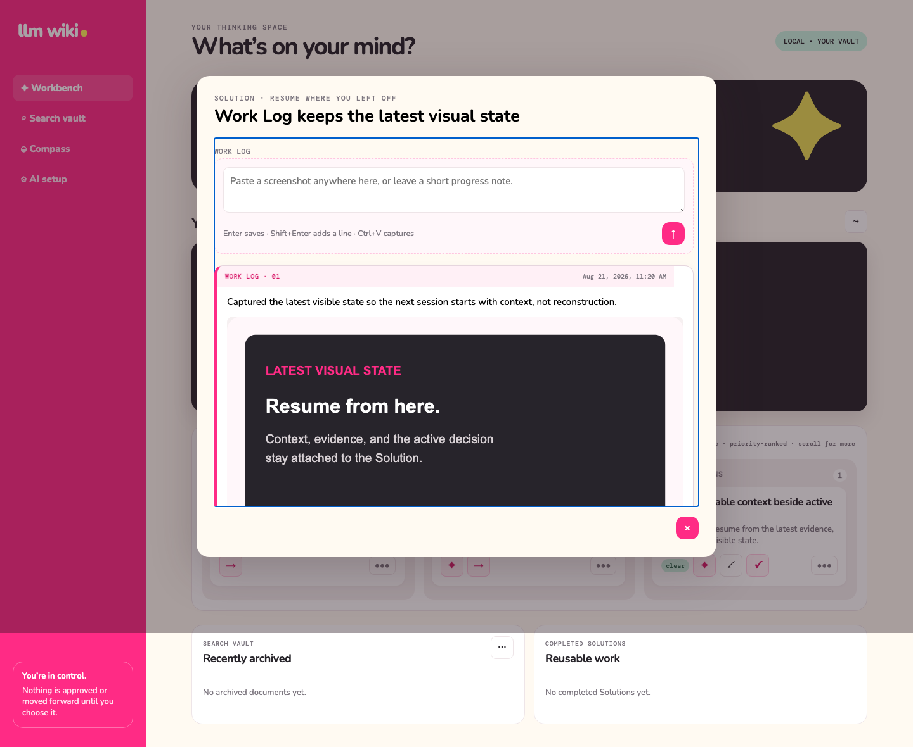

# 완료·Knowledge·아카이브

[English](completion-writeback-archive.md) | **한국어**

> **Private process, portable knowledge.** 작업 맥락은 개인적으로, 완료 결과는 재사용 가능하게 둡니다.

In Progress Solution은 텍스트·스크린샷·댓글·검증 체크리스트가 있는 Work Log를 소유합니다. AI는
스크린샷을 요약하고 검증 기준별 근거를 평가할 수 있지만 완료 결정을 내리지는 않습니다.

사람이 승인한 완료는 Obsidian 호환 Playbook과 원시 근거를 만듭니다. 재생성, 구조화된 Markdown
패치, 아카이브 이동은 source hash로 외부 수정을 보호합니다.

Solution에서 완료하면 연결된 작업 계보 전체를 하나의 database transaction으로 닫습니다. 원본
Problem에 속한 열려 있는 모든 Solution과 Problem 자체가 명시적인 `completed` 상태가 되며, 이미
archive한 Solution의 상태는 유지합니다. 최초 Capture는 Lineage 근거로 보존하지만 해당 Problem으로
정제됐으므로 더 이상 받은 항목에 나타나지 않습니다. Command 결과에는 닫힌
Solution·Problem·Capture ID를 함께 반환하므로 client가 전파 성공 여부를 추측하지 않아도 됩니다.

최종 보고서를 만들기 전에 현재 Lineage를 다시 만들고, 그 Lineage가 참조한 근거를 보고서 입력으로
사용합니다. 재생성할 때는 Lineage와 문서를 함께 갱신합니다. 자세한 내용은
[Lineage Knowledge Layer](lineage-knowledge-layer.ko.md)를 참고하세요.

관련 Spec Kit: [003 — Completion, Writeback, and Archive](../../specs/003-completion-writeback-archive/spec.md)
