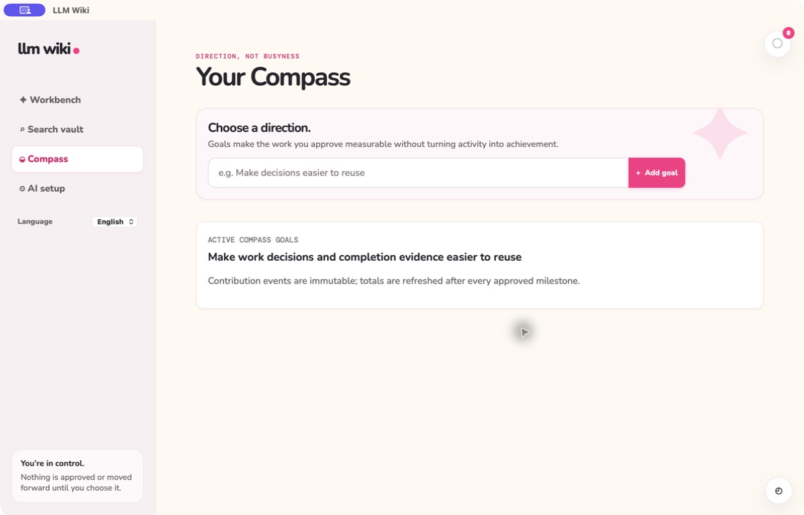

# Compass

**English** | [한국어](direction-dashboard.ko.md)

> **Understand the work, never score the worker.**

Compass stores goals, evidence-backed Problem importance, immutable milestone events, and aggregate
direction signals. These signals describe how work relates to goals; they are not productivity
scores and must never become employee rankings.

The local view remains available during provider failure so people can retain direction and evidence.

Related Spec Kit: [004 — Direction Dashboard](../../specs/004-direction-dashboard/spec.md)

Compass has Direction and Completed tasks tabs. Completed tasks lists every completed Task, including Subtasks, newest completion first. Select a row to open its details. Workbench shows only the five latest completions in a compact list beside active Tasks; categories without pending cards are hidden.

The recent-completion panel matches the adjacent active Tasks panel’s height. On narrow screens, it appears below active Tasks at a height of 320px. Its heading remains visible while the list scrolls vertically, with the newest completion at the top.
