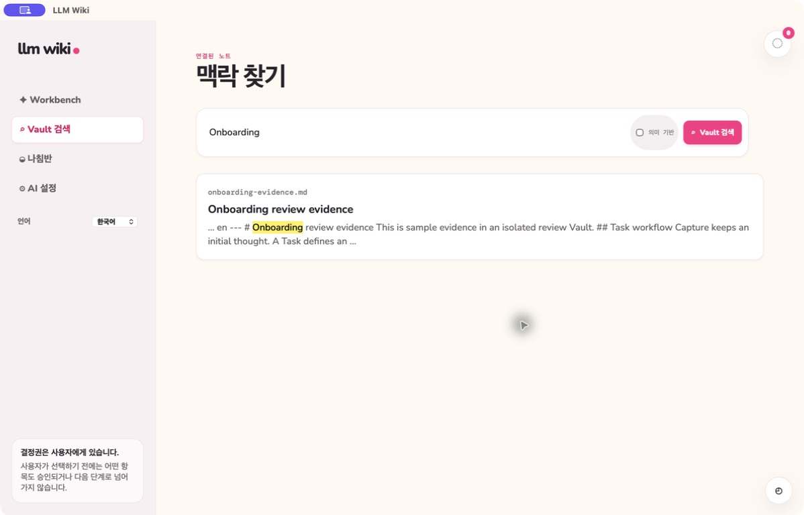

# 빠른 Vault 검색

[English](fast-vault-search.md) | **한국어**

> **Resume where you left off.** 검색은 이전 Knowledge를 현재 결정으로 다시 가져옵니다.

Obsidian 호환 Markdown의 Vault 상대 경로, 제목, heading, 본문을 인덱싱합니다. 버전이 있는
`llm_wiki` YAML 블록으로 명시적인 적용성, 주제별 결정, 아이디어 상태 metadata를 추가할 수
있습니다. Metadata가 없거나 잘못되어도 본문 검색은 유지되며 최종 결정을 만들어 내지 않습니다.
복구본, 철회본, 번역본은 원본 인덱스에서 제외됩니다.
로컬 데이터베이스는 범위가 제한된 section unit과 aspect별 vector를 Markdown과 별도로
보관합니다. 파일이 변경·이동·삭제되면 원본 note를 다시 쓰지 않고 재구성 가능한 인덱스만
증분 갱신합니다.

Semantic 검색은 명시적으로 선택할 때 사용합니다. Exact keyword 일치와 독립적으로 semantic
후보를 모은 뒤 pagination 전에 lexical·semantic 순위를 결합합니다. 적용성에는 더 높은 가중치를
주고, 명시적으로 검증되지 않은 아이디어는 불확실한 상태를 유지합니다. 네이티브 데스크톱 앱은
고정된 다국어 MiniLM ONNX 모델을 포함하므로 모델 다운로드나 Python Runtime이 필요하지 않습니다.
모델·임베딩 장애 중에도 구조 검색은 동작합니다. 결과는 계산된 원본 revision을 보존하고 최대 8개
evidence passage를 반환합니다. Vector input과 고정된 model identity가 일치할 때만 기존 vector를
재사용하며, inference 중 원본 revision이 바뀌면 늦게 도착한 결과를 저장하지 않습니다.

관련 Spec Kit: [001 — Fast Vault Search](../../specs/001-fast-vault-search/spec.md),
[018 — Multi-aspect Knowledge Retrieval](../../specs/018-multiaspect-knowledge-retrieval/spec.md)
