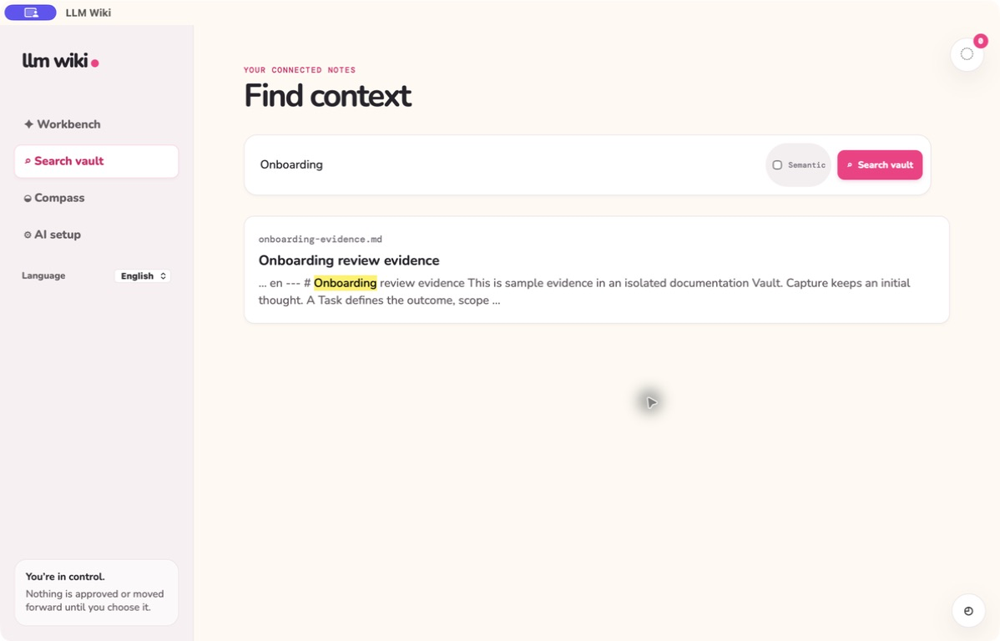

# Fast vault search

**English** | [한국어](fast-vault-search.ko.md)

> **Resume where you left off.** Search brings prior Knowledge back into the current decision.

Search indexes Vault-relative paths, titles, headings, and body text from Obsidian-compatible
Markdown. A versioned `llm_wiki` YAML block may add explicit applicability, topic-specific decision,
and idea status metadata. Missing or invalid metadata leaves body search available and never creates
a final decision. Recovery, withdrawal, and translated copies are excluded from the source index.
The local database keeps bounded section units and per-aspect vectors separately from the Markdown;
changed, moved, and deleted files update that rebuildable index without rewriting source notes.

Semantic retrieval is available when explicitly selected. It collects semantic candidates
independently from exact keyword matches, then combines lexical and semantic ranks before pagination.
Applicability receives more weight, while explicitly unverified ideas remain qualified. The native
desktop app packages the pinned multilingual MiniLM ONNX model and needs no model download or Python
runtime. Structural search remains a fast local fallback during model or embedding failure. Results
retain their computed source revision and return at most eight evidence passages. Vectors are reused
only when their input and pinned model identity match, and a delayed vector result is discarded when
the source revision changed during inference.

Related Spec Kit: [001 — Fast Vault Search](../../specs/001-fast-vault-search/spec.md),
[018 — Multi-aspect Knowledge Retrieval](../../specs/018-multiaspect-knowledge-retrieval/spec.md)
