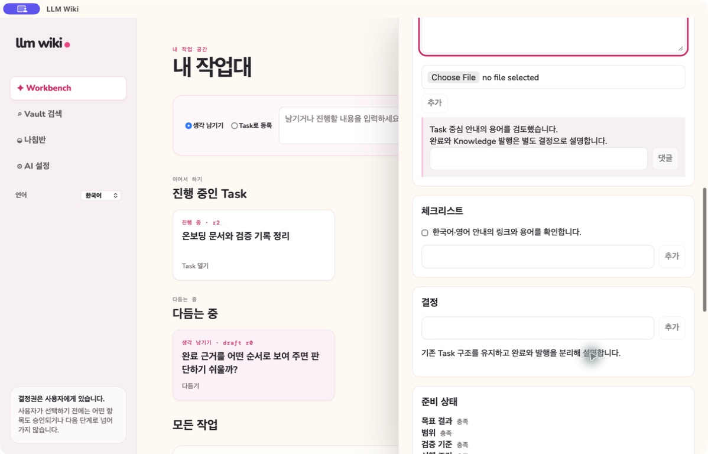

# Task lineage and Knowledge

**English** | [한국어](lineage-knowledge-layer.ko.md)

Task detail keeps its Capture provenance, optional exact Problem revision, Work Log evidence, comments, checklists, decisions, completion evidence, and relationships together. This deterministic record is the source for a private Knowledge draft after a Task is completed; it is not an automatic publication.

Create a draft deliberately, review or correct it, then publish the reviewed Markdown separately. Draft revision and content hash identify the publication source. If the published Vault file changes externally, hash checks prevent a silent overwrite. Regenerating refreshes the draft from the recorded Task; it does not erase the Task's private record.

Earlier Solution lineage tabs, inferred-claim correction views, and automatic completed-work reports are retained legacy behavior/specification history. They are not current Task interface promises.

See [Completion and Knowledge](completion-writeback-archive.md) and [Task-centered Workbench](conflict-gated-workflow.md).
