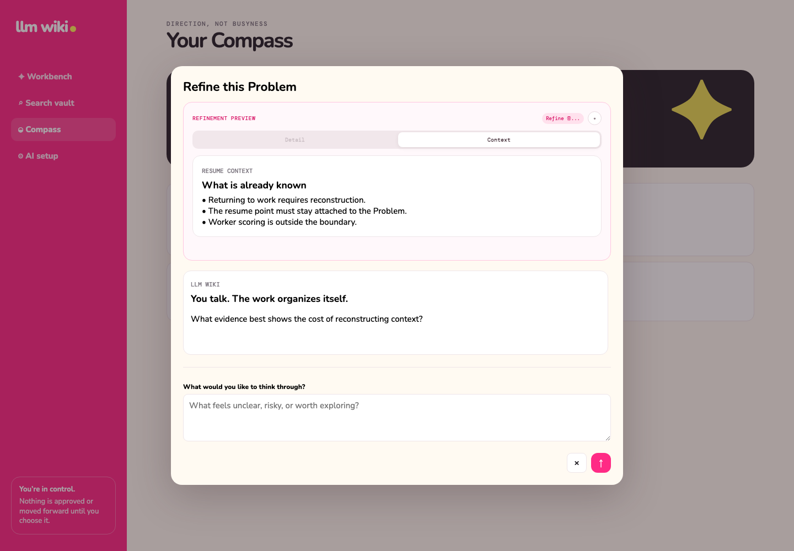
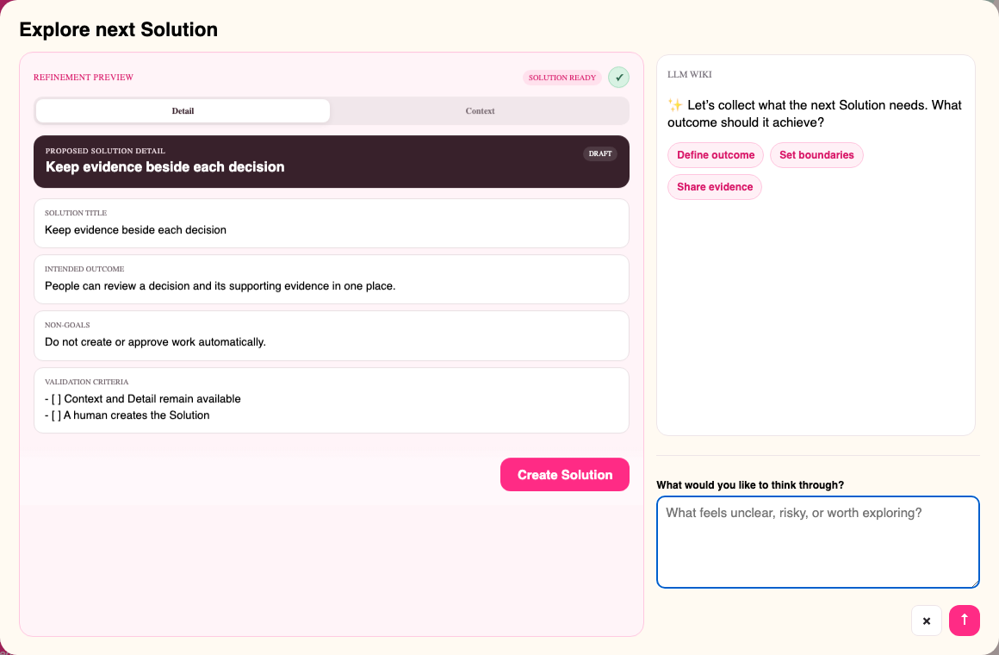

# Context-preserving Refinement Preview

**English** | [한국어](refinement-preview-status.ko.md)

> **Resume where you left off.** Refinement must not erase the context that made the work meaningful.

Selecting a Capture, Problem, or Solution card opens its conversation and Preview in one workspace;
there is no separate Explore action on the card. While you talk with AI, Preview keeps the current
detail, recent conversation, prior drafts, and the Capture → Problem → Solution lineage visible. AI
keeps organizing the proposal; only the user can apply it.

## How Refinement works

1. Select a Capture, Problem, or Solution card.
2. Read **Context** to recover the current item and its lineage.
3. Answer one focused, open-ended AI question about the most important gap.
4. The workspace shows that it is generating the latest structured draft: Preview shows its working
   status and chat shows an animated `...` indicator.
5. Compare **Context** and **Detail** when the Preview switches to the ready draft. Only then does
   chat show `✅ Ready. Your AI refinement is ready to review.`
6. Select **Apply Refinement** only when the proposal is accurate enough.

Problem Detail covers context, impact, evidence, desired outcome, boundaries, and open questions.
Solution Detail covers intended outcome, scope, non-goals, prior evidence, trade-offs, dependencies,
validation criteria, risks, and open questions. Unknown values remain explicitly unknown.

## Context that survives

Preview is built deterministically from locally stored records rather than another summarization
request. It includes the current title and detail, recent Explore conversation and drafts, the
originating Capture for a Problem, and the parent Problem for a Solution. The bounded view favors
recent context so old history does not overwhelm current work. Reopening Explore restores the latest
draft and marks already applied content as **APPLIED**.

## Background status and failure behavior

| Status | Meaning |
| --- | --- |
| `LIVE CONTEXT` | Context is ready and conversation can begin. |
| `REFINING…` | A new draft is being prepared; chat remains usable. |
| `DRAFT READY` | Detail is ready to compare and review. |
| `APPLIED` | The displayed draft has already been applied. |
| `NEEDS ATTENTION` | Generation failed; existing context and drafts remain intact. |

If Context cannot load, the empty Preview closes and an accessible warning remains on the usable
conversation. Moving to another item discards stale requests so a late response cannot overwrite the
new Preview.

The Ready message is a completion signal, not the beginning of draft generation: it appears only
after the generated draft is rendered in Preview for review.

## Explore the next Solution

An approved Problem uses the same workspace to explore another Solution—without introducing a Task
stage or a separate review modal.

After each response, AI refreshes a proposal with a title, intended outcome, non-goals, and validation
criteria. **Create Solution** is the explicit human action that creates it. Reopening the workspace
restores the last proposal and marks an already used proposal as **CREATED**. After creation succeeds,
the Explore modal closes automatically; it remains open while creation is pending or if creation fails.

A Capture opens an **Explore Problem** workspace with Preview before it becomes a Problem. Conversation
and Refinement can shape the proposal without changing the Capture's state; **Create Problem** is the
explicit human action that promotes it and preserves the conversation as lineage.
The Explore modal closes automatically only after that promotion succeeds, so validation and creation
errors remain visible and retryable in place.

Related Spec Kit: [005 — Refinement Preview Status](../../specs/005-refinement-preview-status/spec.md)
