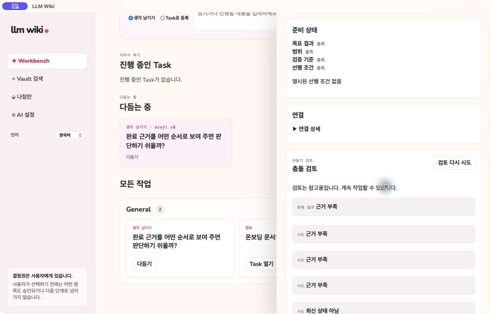

# Task 충돌 검토를 위한 Vault 근거

[English](vault-conflict-evidence.md) | **한국어**

Task 충돌 검토는 저장한 Task 맥락과 선택한 Vault 근거로 인용 가능한 비동기 보고서를 만듭니다. Queue는 시도와 상태를 보존하므로 검토가 실행되는 동안에도 Workbench를 사용할 수 있습니다.

보고서는 워크플로 Gate가 아니라 근거입니다. 출처를 읽고 Task에서 무엇을 바꿀지 사용자가 결정합니다. 보고서가 Task를 clear로 표시하거나 상태를 진행시키거나 완료 근거를 대신하지 않습니다. Task 리비전이나 관련 Vault 맥락이 바뀌면 이전 보고서는 오래된 상태가 됩니다.

예전 브라우저 취소, 일괄 Solution 주장 선별, clear/conflicted Gate는 레거시 구현 기록입니다. 이전한 기록에서 읽을 수 있어도 현재 Task 인터페이스가 제공한다고 약속하는 제어가 아닙니다.

[Task 충돌 검토](conflict-resolution-workflow.ko.md)와 역사 기록인 [명세 008](../../specs/008-vault-conflict-evidence/spec.md)을 참고하세요.
