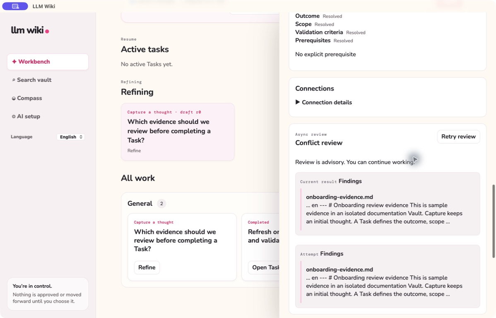
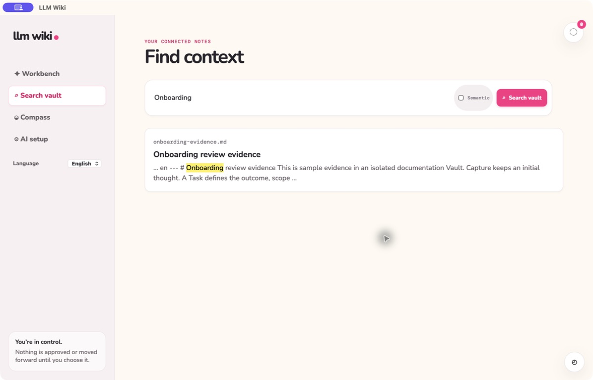

# Current interface guide

**English** | [한국어](visual-guide.ko.md)

This guide shows nine actual captures from signed macOS apps in English light mode. The Workbench capture was refreshed from the latest build with the mode options and Save action below the text input. The other eight captures are retained because their screens did not change. See the capture records below for each source. All examples use isolated disposable data. Refinement and conflict review used a deterministic local provider; these captures do not establish external AI quality. Queue shows a real missing-key failure, and completion shows an unpublished private draft.

The [earlier English capture manifest](../testing/evidence/docs-language-consistency.json) records the original nine English captures from the previously verified package. Its Workbench image has since been replaced; the entry layout evidence below records the current image. The capture source below identifies that package, rather than this documentation branch: base `de01ff47398871902a765d43b5a4060161316f92`, branch `fix/ui-ux-improvements`, dirty source build signed at 11:44:31 AM with CDHash `9b2b81082a43de0637bedd33a8cc670709ff2b21` by `LLM Wiki Local Signing`. The same package passed all 32 desktop scenarios and all 175 registered controls. See [release verification](../../specs/012-task-centered-workbench/acceptance-verification.md) for evidence and limits.

The refreshed Korean and English Workbench captures and build checks are recorded in the [entry layout evidence](../testing/evidence/capture-entry-layout.json). The earlier build provenance and release verification above apply to the other retained screens.

## Workbench and Task detail

The Workbench places Capture first and in-progress Tasks immediately below it. Category swim lanes follow, with General always first and Inbox, Refining, and Refined Tasks columns inside each category. Each category body scrolls vertically within a maximum height of 480px or 65% of the viewport, whichever is smaller. Save text as a Capture or create a Task directly; completed Tasks can be expanded in the right lane. A Problem is optional context that may be linked to a Task; it is not a required stage.

Open a Task to edit its definition, keep Work Log evidence, comments, checklists, decisions, relationships, completion evidence, and Knowledge actions together. Completing the Task, resolving a linked Problem, and publishing Knowledge are separate explicit decisions.

## Refinement and completion

Refinement keeps original context, conversation, notes, and reviewable proposals together. A saved workspace supports returning to unfinished refinement; a provider or save error remains visible for retry rather than representing a completed result.

Conflict review is advisory and retains attempt history. The example below shows findings cited to
`onboarding-evidence.md` and a Retry review action; citations remain evidence for the user's judgment,
not permission to complete or publish.

After a Task has completion evidence, create and review a private Knowledge draft. Publication is a separate human action that writes the reviewed Markdown to the Vault.

## Queue, search, Compass, and AI setup

The background Queue identifies durable jobs and their recovery actions. It does not turn a failed or pending AI request into a completed Task decision.

Search reads the selected Vault, while Compass records direction without scoring people. AI setup shows connection and model-routing settings while keeping credential values masked.

See the [Task-centered Workbench](conflict-gated-workflow.md), [Completion and Knowledge](completion-writeback-archive.md), and [Background AI Queue](background-ai-queue.md) for behavior and verification boundaries.
