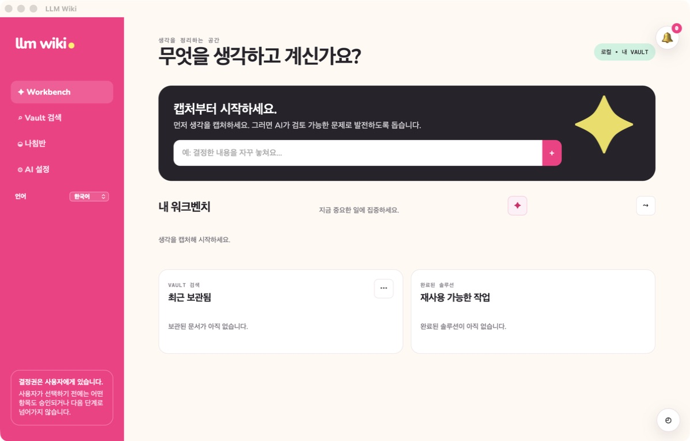
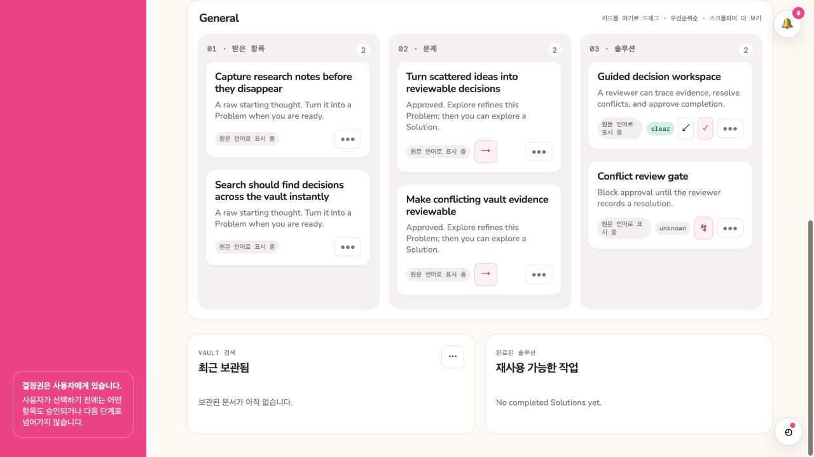
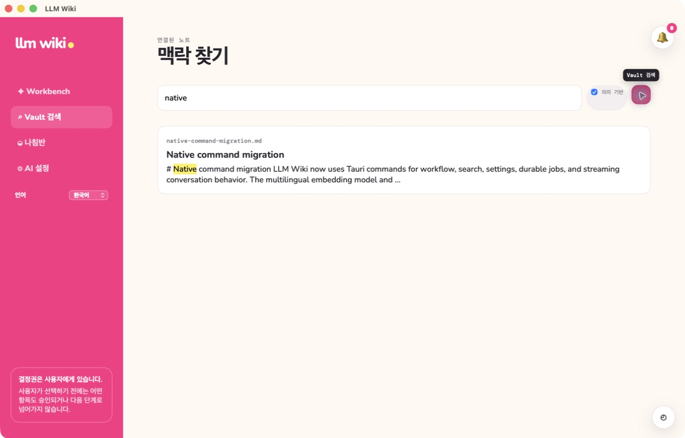
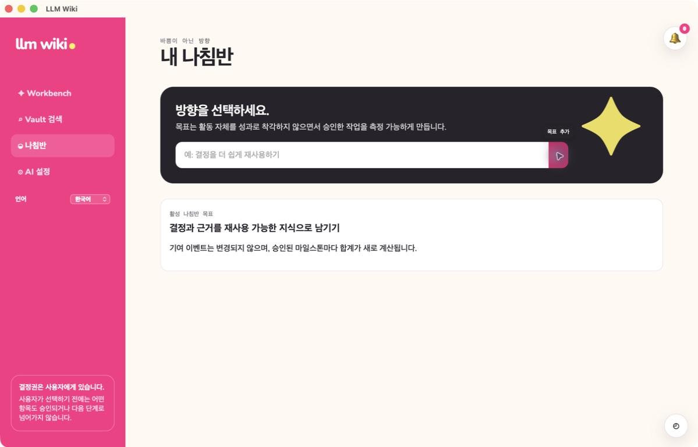
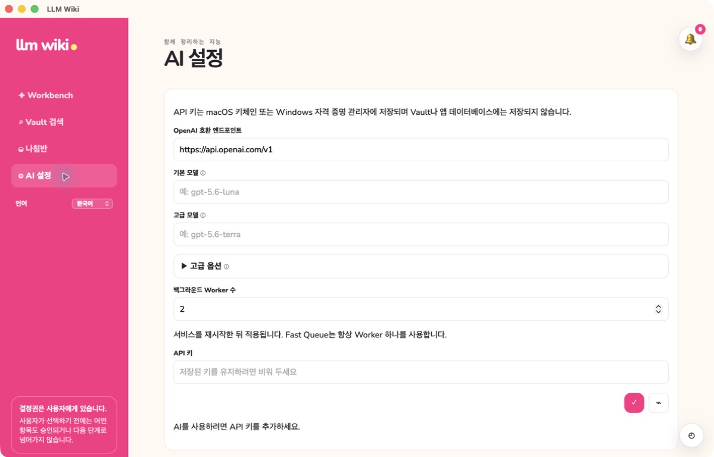
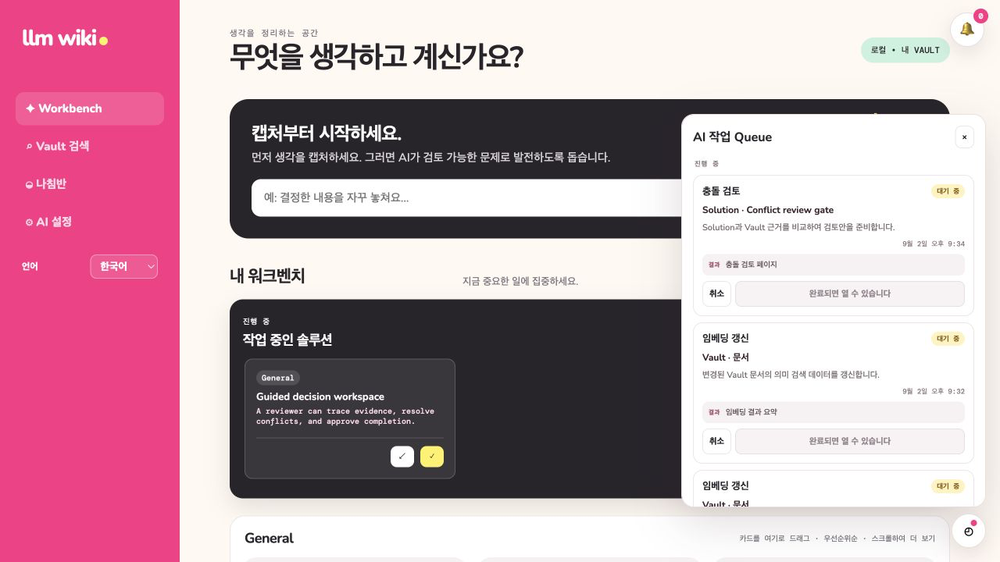
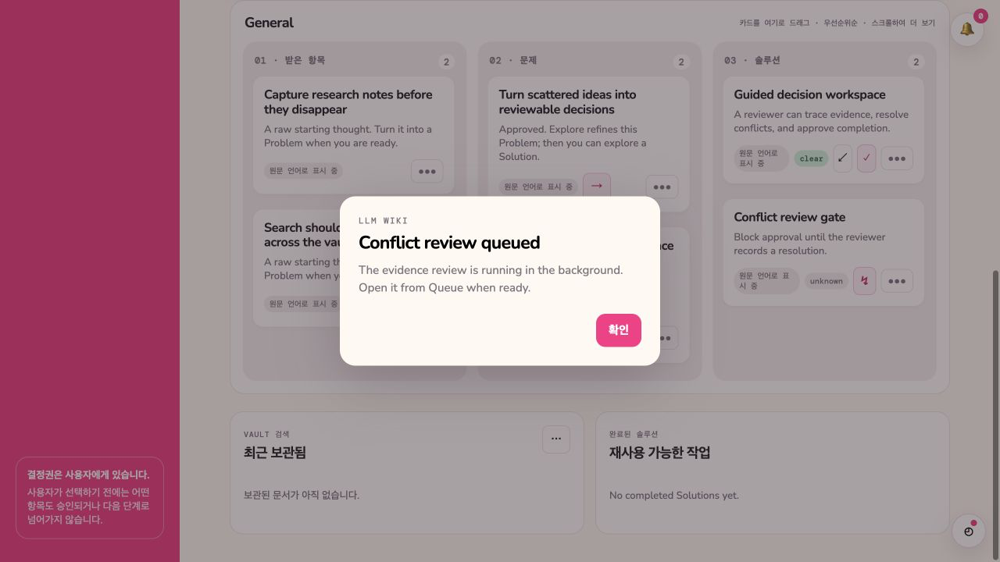

# Visual feature tour

**English** | [한국어](visual-guide.ko.md)

The four primary screenshots below were recaptured from the packaged native application after the
React/Tauri cutover reached `main`. They use an isolated documentation Vault and database; no
personal Vault content or credential value appears. Each image represents a product capability,
while the later detailed images document deeper workflow states.

The screenshots below preserve the workflow examples that were captured for this guide. The current
application uses the calmer cream-and-pale-rail appearance described in the next section, so its
surface styling may differ from these historical images.

## Reading the workspace

LLM Wiki uses a warm cream workspace with a calm pale navigation rail and restrained pink accents.
The current view names the primary task first; Capture stays compact, while active Solutions,
workflow lanes, and reusable context receive the strongest visual weight. Cards, drawers, dialogs,
Queue, and notifications share the same readable surface, focus, and status treatment. Search
starts with an explicit local-Vault prompt and shows loading, empty, or failure feedback in place.
At narrow desktop widths navigation wraps and the workbench actions remain available rather than
overflowing. These presentation changes do not change approval boundaries: AI may prepare or
organize work, and people still choose every workflow transition.

## 1. Capture, Problem, and Solution

The current Workbench capture shows a Korean user-visible locale rendered with the bundled Noto
Sans KR font. Saving the sample Capture writes through the typed application client and Tauri
workflow command; it does not call a loopback web server.

The Workbench keeps the primary workflow visible in one place. Cards retain their current state,
and actions that change approval or workflow state remain explicit user decisions.

Related guides: [Workbench](conflict-gated-workflow.md),
[localization](bilingual-localization.md), and
[conflict review](vault-conflict-evidence.md).

## 2. Explore without losing context

Explore opens the stored Detail, lineage context, and conversation in one workspace. AI can prepare
a refinement, but the proposal is not applied until the user chooses to apply it.

Related guide: [Refinement Preview](refinement-preview-status.md).

## 3. Execute with a durable work record

The Work tab keeps validation criteria, checked state, progress notes, and review comments together.
This evidence remains available to completion and lineage generation.

Related guides: [Completion and Knowledge](completion-writeback-archive.md) and
[Lineage Knowledge Layer](lineage-knowledge-layer.md).

## 4. Recover existing Knowledge

Vault Search returns local Markdown context. The selected semantic result shown here was produced
by the multilingual embedding model bundled in the `.app`; no embedding service or startup
download is involved. Lexical search remains available if local inference fails.

Related guide: [Fast vault search](fast-vault-search.md).

## 5. Keep direction visible

Compass records an active direction without converting individual activity into a performance
score.

Related guide: [Compass](direction-dashboard.md).

## 6. Configure AI without exposing secrets

AI Settings separates endpoint and model routing from the credential itself. The saved key is kept
in native secret storage and its value is never returned to the UI.

Related guide: [Background AI Queue](background-ai-queue.md).

## 7. Observe background work

Durable work stays visible by purpose and target. The Queue exposes cancellation, retry, progress,
and result destinations without presenting internal job JSON as the user experience.

Starting a durable review acknowledges that work continues in the background and directs the user
to the Queue instead of blocking the Workbench.

Related guides: [Background AI Queue](background-ai-queue.md),
[Vault conflict evidence](vault-conflict-evidence.md), and
[Conflict Resolution Workflow](conflict-resolution-workflow.md).
