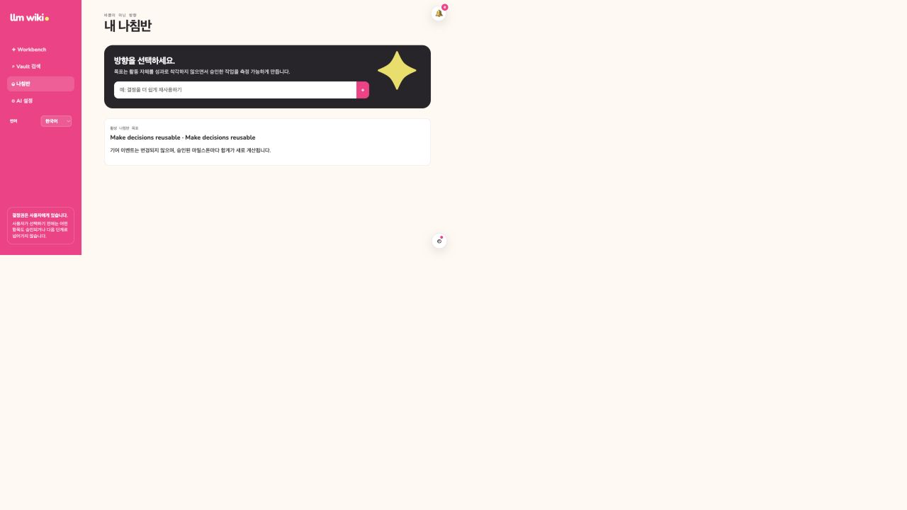
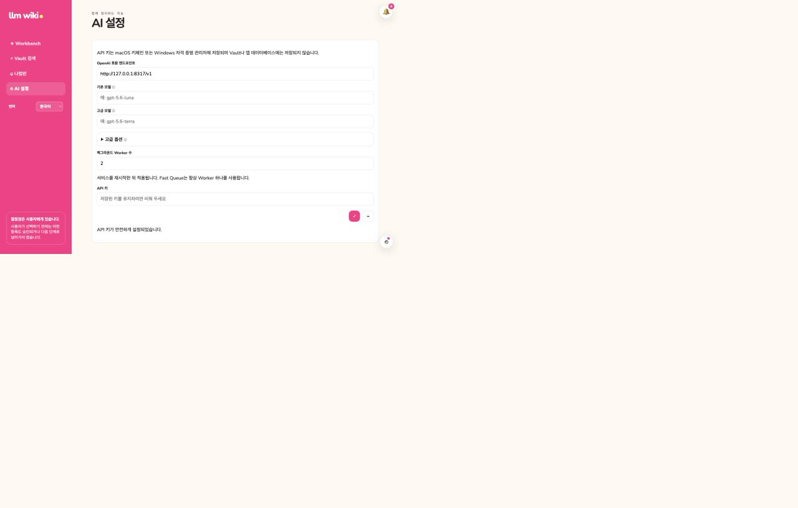

# Visual feature tour

**English** | [한국어](visual-guide.ko.md)

These screenshots were captured from the application after the React and Tauri migration was
merged to `main`. They use an isolated documentation Vault and sample records; no personal Vault
content or credential value appears in the images. The same React surfaces run in the Tauri
WebView. Native command behavior is covered separately by the desktop E2E suite.

## 1. Capture, Problem, and Solution

The Workbench keeps the primary workflow visible in one place. Cards retain their current state,
and actions that change approval or workflow state remain explicit user decisions.

Related guides: [Workbench](conflict-gated-workflow.md),
[localization](bilingual-localization.md), and
[conflict review](vault-conflict-evidence.md).

## 2. Explore without losing context

Explore opens the stored Detail, lineage context, and conversation in one workspace. AI can prepare
a refinement, but the proposal is not applied until the user chooses to apply it.

Related guide: [Refinement Preview](refinement-preview-status.md).

## 3. Execute with a durable work record

The Work tab keeps validation criteria, checked state, progress notes, and review comments together.
This evidence remains available to completion and lineage generation.

Related guides: [Completion and Knowledge](completion-writeback-archive.md) and
[Lineage Knowledge Layer](lineage-knowledge-layer.md).

## 4. Recover existing Knowledge

Vault Search returns local Markdown context and keeps lexical search available even when semantic
indexing or an external model is unavailable.

Related guide: [Fast vault search](fast-vault-search.md).

## 5. Keep direction visible

Compass records an active direction without converting individual activity into a performance
score.

Related guide: [Compass](direction-dashboard.md).

## 6. Configure AI without exposing secrets

AI Settings separates endpoint and model routing from the credential itself. The saved key is kept
in native secret storage and its value is never returned to the UI.

Related guide: [Background AI Queue](background-ai-queue.md).

## 7. Observe background work

Durable work stays visible by purpose and target. The Queue exposes cancellation, retry, progress,
and result destinations without presenting internal job JSON as the user experience.

Starting a durable review acknowledges that work continues in the background and directs the user
to the Queue instead of blocking the Workbench.

Related guides: [Background AI Queue](background-ai-queue.md),
[Vault conflict evidence](vault-conflict-evidence.md), and
[Conflict Resolution Workflow](conflict-resolution-workflow.md).
