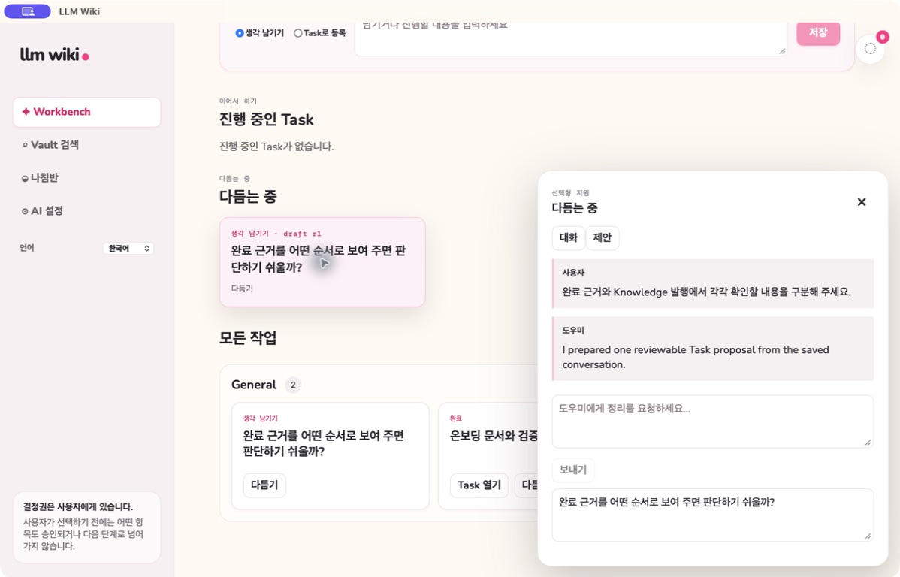
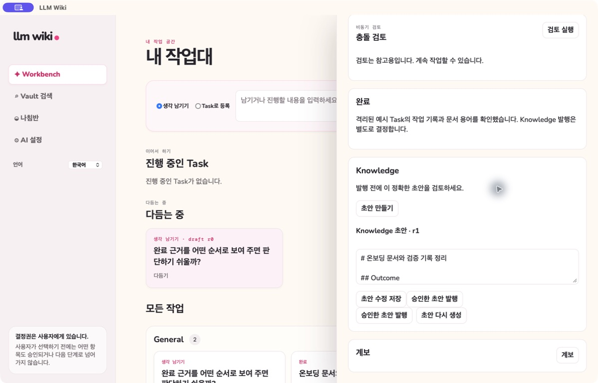
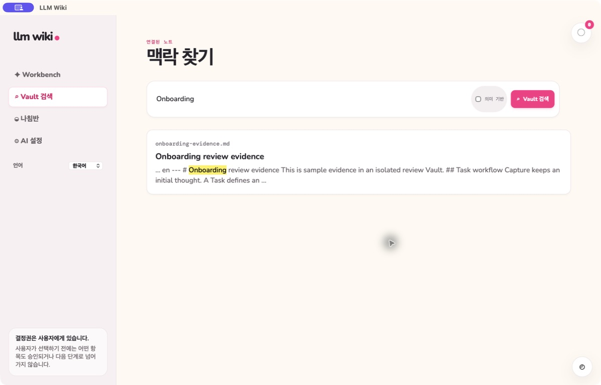
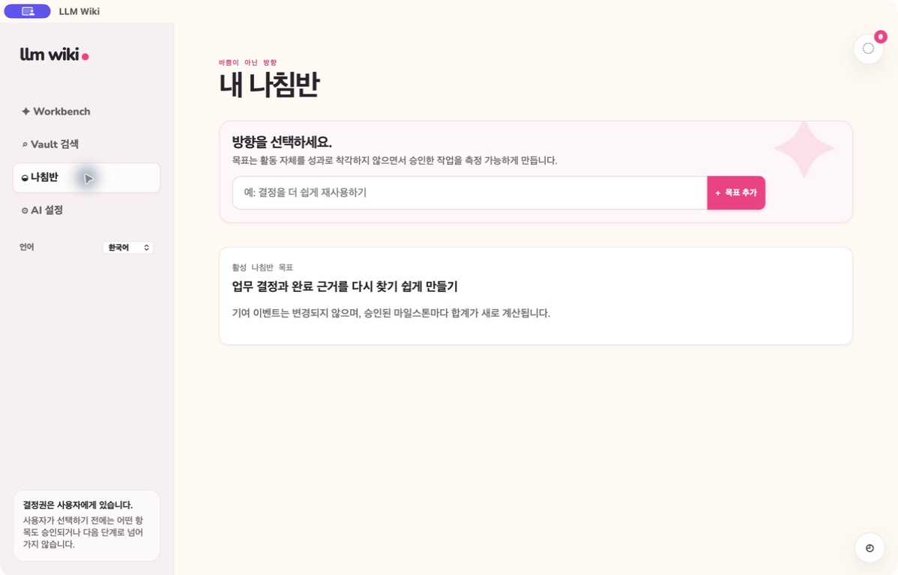

# Current interface guide

**English** | [한국어](visual-guide.ko.md)

This guide shows nine actual captures from the signed macOS package on 2026-09-12, in Korean light mode. Each PNG is 1198×768 including the native title bar; this is an image size, not a WebKit viewport claim. The app used isolated disposable data, example Tasks, Work Log, and completion evidence. Refinement and conflict review used a deterministic local provider; these captures do not establish external AI quality. Queue shows a real missing-key failure, and the completion capture shows an unpublished private draft.

Capture source: base `de01ff47398871902a765d43b5a4060161316f92`, branch `fix/ui-ux-improvements`, dirty source build signed at 11:44:31 AM with CDHash `9b2b81082a43de0637bedd33a8cc670709ff2b21` by `LLM Wiki Local Signing`. The same package passed all 32 desktop scenarios and all 175 registered controls. See [release verification](../../specs/012-task-centered-workbench/acceptance-verification.md) for evidence and limits.

## Workbench and Task detail

The Workbench starts with a lightweight entry: save the text as a Capture or create a Task directly. Saved work and resumable refinement shortcuts remain available below it. A Problem is optional context that may be linked to a Task; it is not a required stage.

Open a Task to edit its definition, keep Work Log evidence, comments, checklists, decisions, relationships, completion evidence, and Knowledge actions together. Completing the Task, resolving a linked Problem, and publishing Knowledge are separate explicit decisions.

## Refinement and completion

Refinement keeps original context, conversation, notes, and reviewable proposals together. A saved workspace supports returning to unfinished refinement; a provider or save error remains visible for retry rather than representing a completed result.

Conflict review is advisory and retains attempt history. The example below reports insufficient evidence; it is not a cited finding or permission to complete or publish.

After a Task has completion evidence, create and review a private Knowledge draft. Publication is a separate human action that writes the reviewed Markdown to the Vault.

## Queue, search, Compass, and AI setup

The background Queue identifies durable jobs and their recovery actions. It does not turn a failed or pending AI request into a completed Task decision.

Search reads the selected Vault, while Compass records direction without scoring people. AI setup shows connection and model-routing settings while keeping credential values masked.

See the [Task-centered Workbench](conflict-gated-workflow.md), [Completion and Knowledge](completion-writeback-archive.md), and [Background AI Queue](background-ai-queue.md) for behavior and verification boundaries.
