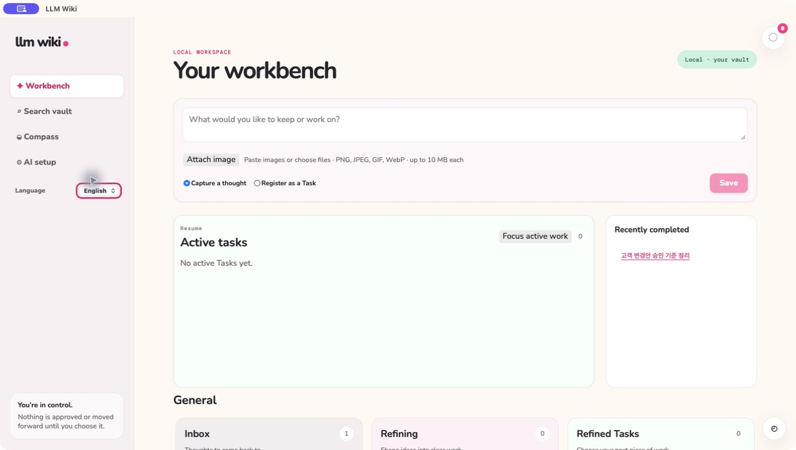
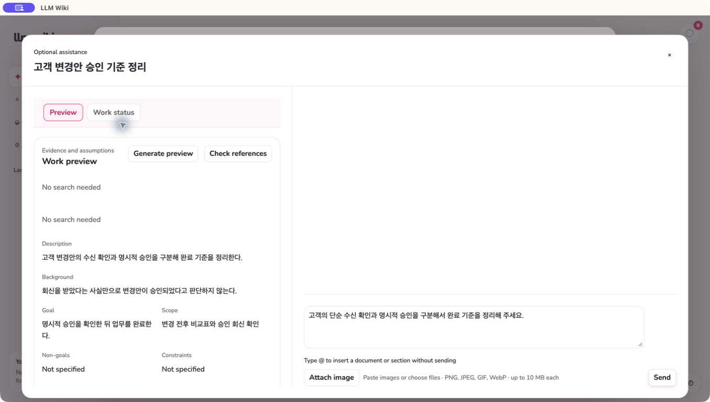
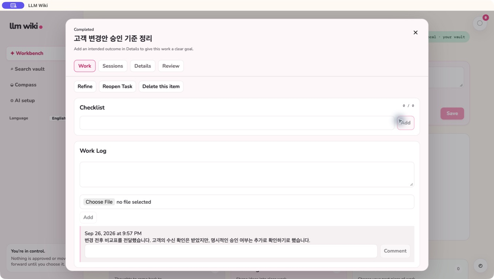
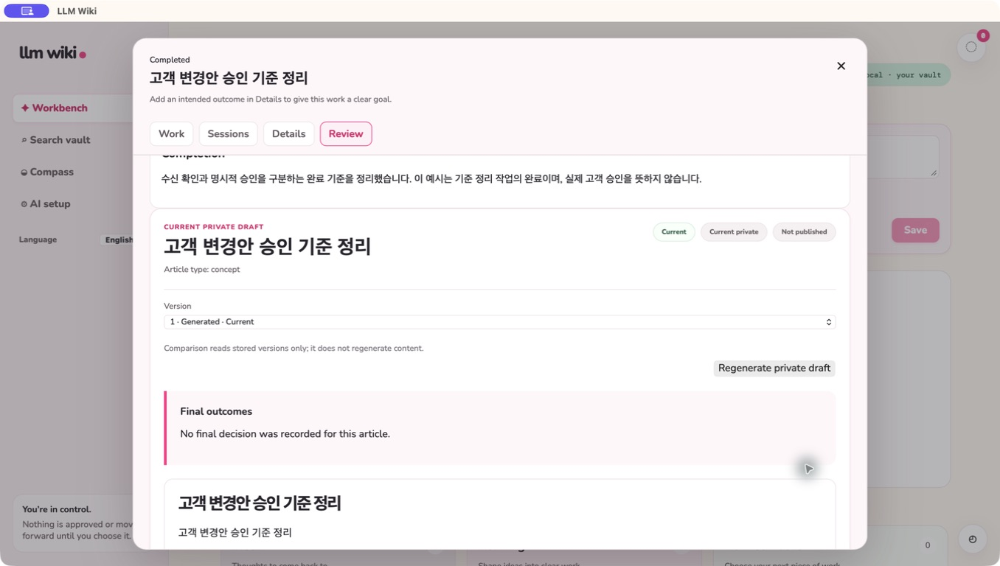

# Current interface guide

**English** | [한국어](visual-guide.ko.md)

Verified on 2026-09-26 against a signed native application built from `db4ada7`, with documentation
based on `51cc1e2`. This guide follows the current application interface and the decisions a user
makes from Capture through published Knowledge. The current screenshots and their capture limits
are recorded in the [capture manifest](../testing/evidence/current-interface.json).

The primary navigation opens **Workbench**, **Search vault**, **Compass**, and **AI setup**.
Workbench is where an idea becomes tracked work; the other views find evidence, record direction,
and configure AI connections and model routing.

## 1. Capture an idea or register a Task

Workbench starts with a compact entry that saves the same input as a **Capture** or registers it
directly as a **Task**. Active Tasks and recently completed Tasks appear next. Below them, **Inbox**,
**Refining**, and **Refined Tasks** organize the remaining work. **Focus active work** hides the entry
and lower sections when current Tasks need the full view.

*The native Workbench keeps the Capture or Task entry above active and recently completed work. The
lower Inbox, Refining, and Refined Tasks sections continue below the visible fold.*

Saving a Capture preserves its text and images immediately. The card stays in Inbox while one
background job prepares a readable title and body from that exact saved source. Its state shows
whether organization is running, complete, or needs attention. Generated text does not replace the
source, create a Task, or move the Capture. Refinement exposes the source separately, and a failed
cleanup can be retried without losing it.

See [Automatic Capture organization](capture-auto-distillation.md) and
[Task-centered Workbench](conflict-gated-workflow.md).

## 2. Refine with conversation and exact references

Choose **Refine** when the work needs more context. Chat remains usable while the first structured
preview and optional reference investigation run in the background. The preview records proposed
background, goal, scope, non-goals, constraints, completion criteria, approach, and assumptions.
Missing evidence remains visible as an assumption.

*The Preview and Work status tabs share the Refinement workspace with Chat. This captured preview
was saved after a manual edit; the text in the composer has not been sent, and the preview reports
that no search is needed.*

Type `@` in Chat to find local documents and sections. A sent mention retains its exact document
version and section. The reference list distinguishes discovery, viewing, mentioning, actual use,
adoption, and exclusion. Finding a source alone never makes it adopted evidence. The exact-source
viewer can revisit viewed sources and open previous or next versions without changing the Task.

Preview edits and restores append immutable versions. A newer background result cannot overwrite
an unsaved edit. **Apply to Task** separately checks the current preview, Task, conversation,
hierarchy, and sources before changing the Task. Closing the workspace or continuing Chat does not
apply the proposal.

See [Reference-aware work previews](reference-aware-workbench.md) and
[Refinement Preview](refinement-preview-status.md).

## 3. Work in the four Task tabs

Opening a Task shows four tabs in this order:

- **Work** holds the checklist, recorded Work Log evidence, comments, attachments, and explicit
  decisions. A completed Codex Run can add a readable **Distilled Run result** while preserving the
  original evidence. Suggestions, decisions, attempts, observations, performed work, and verification
  remain distinct.
- **Sessions** contains saved work conversations. A note is local; **Run with Codex** separately
  creates a Run and linked Work Log record. Execution never completes the Task or
  publishes Knowledge.
- **Details** shows and edits the canonical Task definition, original Capture, and Task connections.
  Unsaved definition changes are protected when leaving the Task.
- **Review** brings together the evidence-backed Task journey, **Current decisions and evidence**,
  readiness, conflict review, completion evidence, and Knowledge review. AI findings remain advisory;
  completion is an explicit user action.

*The Task workspace keeps Work, Sessions, Details, and Review together. The visible Work Log entry
was recorded manually and is preserved as work evidence.*

The Task journey updates incrementally from recorded evidence. An explicit saved decision can become
current, superseded, withdrawn, or unresolved. Ordinary assistant prose does not become an adopted
decision. If a source changes, the last good distilled view remains readable with a stale label while
its update runs.

See [Task work sessions](task-work-sessions.md), [Task conflict review](conflict-resolution-workflow.md),
and [Task lineage and Knowledge](lineage-knowledge-layer.md).

## 4. Review Knowledge before publication

After completion, **Review** can generate a private Knowledge draft from the exact current Task,
completion record, distilled work, evidence, and references that were actually used. **Final
outcomes** appear separately from the article. **Ideas to revisit** stays collapsed outside the final
article, retaining whether each idea is unverified, deferred, out of scope, or rejected.

*The captured version is the current private, unpublished first draft. It reports that this example
has no recorded final decision; the screenshot does not show publication.*

Each generation, edit, or restore appends an immutable private version. The version picker reads,
compares, and restores saved versions without regenerating them. Source changes mark a version stale
but do not erase it.

Publication starts with a separate archive proposal. Review the exact files, paths, source links,
selected idea files, and managed index changes before choosing **Publish these exact files**.
Publication completes only after the reviewed files are written and indexed. A pending index,
conflict, or repair state remains visible and recoverable.

See [Evidence-bound Knowledge drafts](knowledge-distillation.md),
[Reviewed Knowledge archive](knowledge-archive.md), and
[Completion and Knowledge](completion-writeback-archive.md).

## Capture evidence

The four screenshots above are actual native application captures. The English interface retains
Korean example content entered by the user; it does not represent automatic translation. Their
source revision, signed application identity, image hashes, dimensions, controlled local provider,
and verification limits are recorded in the [current capture manifest](../testing/evidence/current-interface.json).

The other images in `docs/features/images/` document an earlier interface and are not embedded as
the current workflow. The original nine-screen set came from base commit
`de01ff47398871902a765d43b5a4060161316f92`; its provenance and limits remain in the
[English capture manifest](../testing/evidence/docs-language-consistency.json) and later
[entry-layout record](../testing/evidence/capture-entry-layout.json). These records are useful for
history, not for verifying the interface described above.
