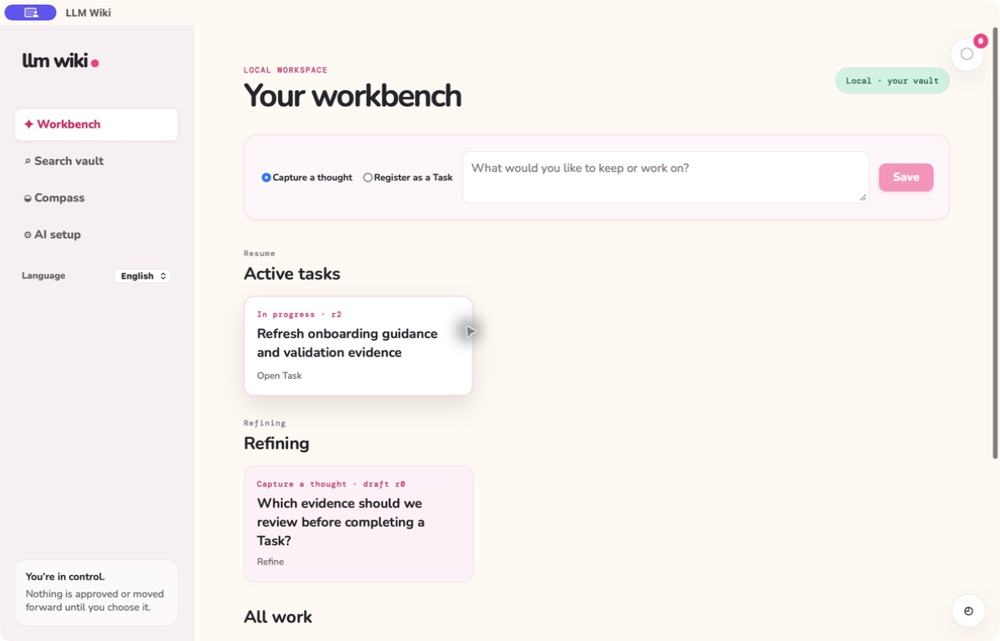
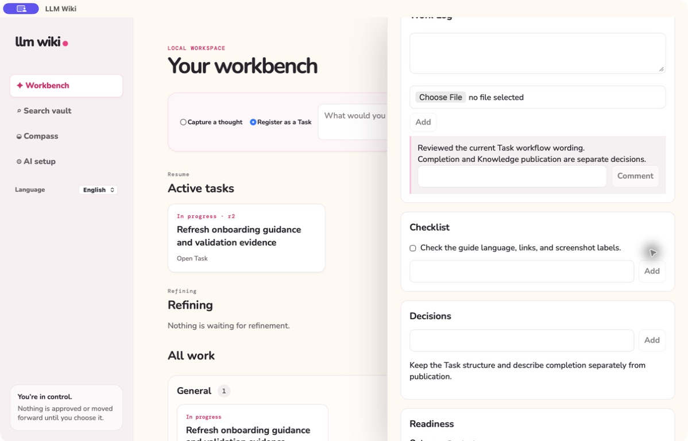
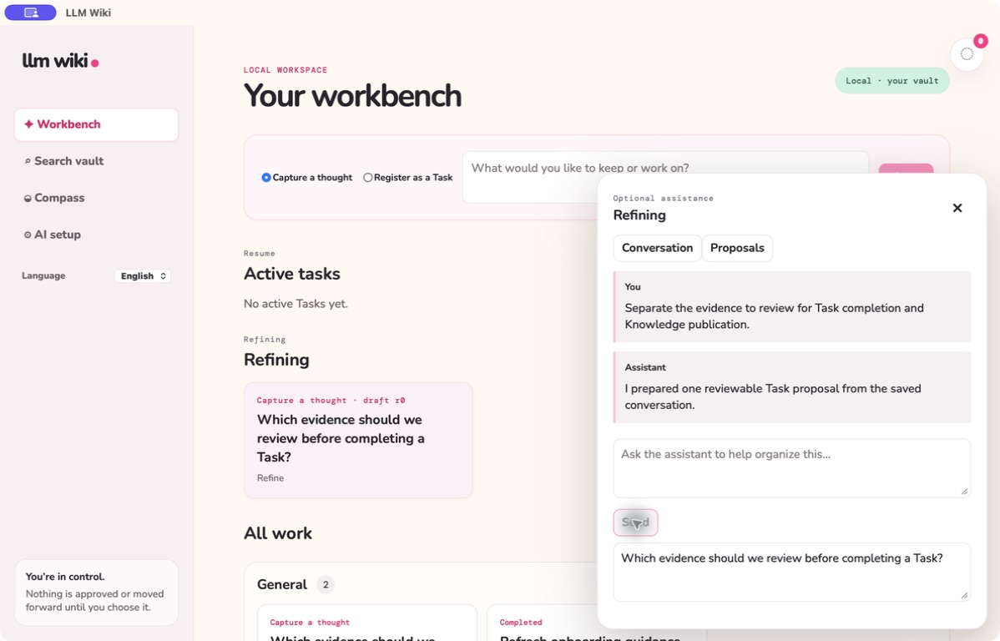
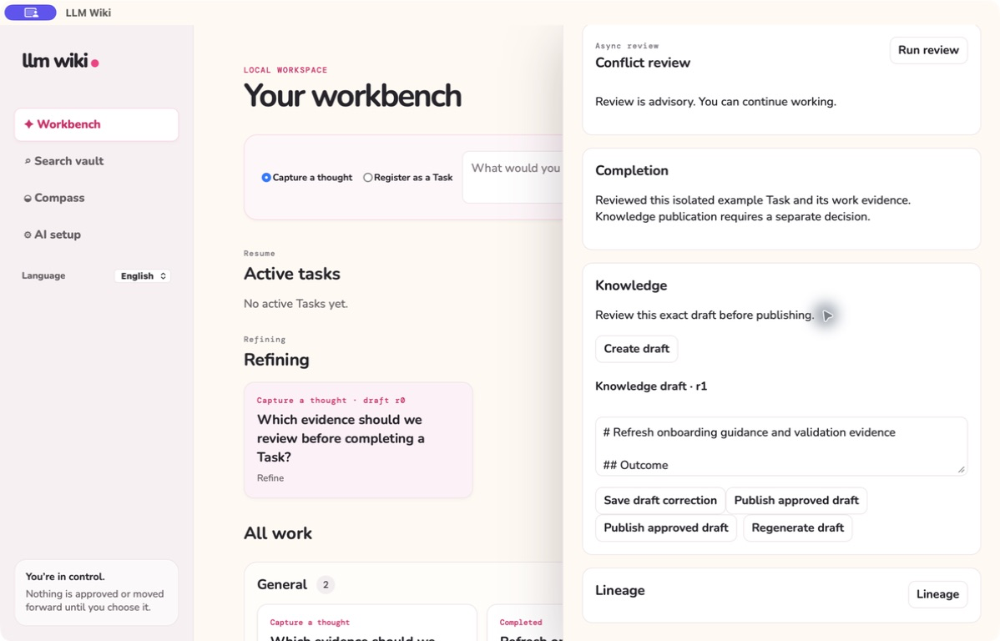

# Product Spirit in LLM Wiki

**English** | [한국어](product-spirit.ko.md)

Product Spirit is the first test for every product and engineering decision. The
[constitution](../.specify/memory/constitution.md) turns these principles into a mandatory review gate.

## 1. You talk. The work organizes itself.

Capture accepts natural thought. AI conversation and Refinement discover structure, preserve the
speaker's intent, and produce editable proposals. The user reviews the organization instead of
performing it up front.

## 2. Reduce cognitive load.

Capture remains deliberately small. The Workbench keeps current Tasks visible and gives in-progress
work a dedicated highlight. Detail, validation, and completion controls
appear only when the current decision needs them.

## 3. Resume where you left off.

Task Work Log accepts text, screenshots, comments, and validation checks. Refinement keeps prior
decisions, evidence, constraints, and trade-offs visible. Conflict review compares the current Task
with searchable Knowledge, so the user does not reconstruct context manually.
The global Korean/English setting changes system language without discarding the active view or
workflow lineage. Generated text is requested in the active language; authored Work Log evidence
and legacy content remain readable in their original form. Managed Knowledge has a separate,
explicit Korean reading flow and does not change its English canonical Markdown.

## 4. Organize around chosen work.

Capture preserves the solution already found. A simple Task may begin immediately, while optional
Refinement can produce a reviewable Problem and multiple revisioned Tasks. Tasks have independent
`task`, `in_progress`, and `completed` states. Work Logs hold authored text, images, files, comments,
checklists, and decisions; completing a Task does not silently resolve a Problem.

## 5. Private process, portable knowledge.

Chats, drafts, refinements, progress, and completed-work decisions remain private local process.
Completion and publication are separate human decisions. Explicit Knowledge publication creates an
Obsidian-compatible Playbook and raw evidence bundle. That Markdown remains useful
without LLM Wiki and can be searched as Knowledge for future conflict review.
App-managed Knowledge uses English Markdown as its canonical portable source. A Korean reading
version is derived on request and can be reused only for the exact current source; it never replaces
or rewrites the canonical file.

## 6. Understand the work, never score the worker.

Compass explains goals, evidence, milestone events, and direction. It must never convert those
signals into an employee score, productivity rank, or personal judgment. Future team features must
preserve this boundary in language, data, access, and visualization.
